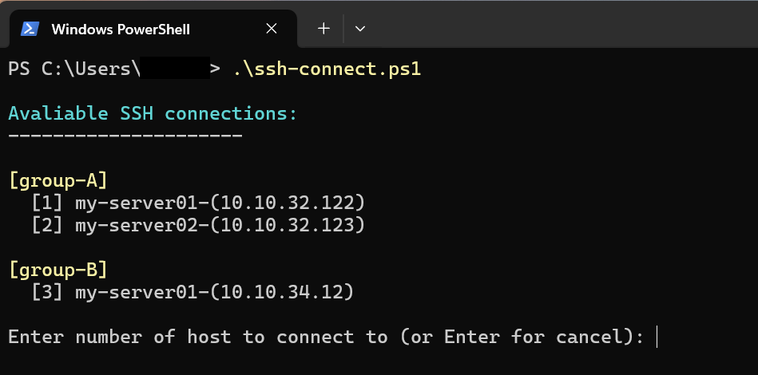

# 🐚 ssh-connection

Very simple and not at all perfect script, that makes easy handling of SSH connections with specific SSH keys. Connections can be grouped to segments.

&nbsp;

## How to run

Simply run powershell script from current folder and pick your favorite connection.




## 📜 Configuration

Script expects file `.ssh\config` to implements groups, for example:

```config
# [group-A]
Host my-server01-(10.10.32.122)
   Hostname 10.10.32.122
   IdentityFile .\.ssh\key01.ppk
   User yoda

Host my-server02-(10.10.32.123)
   Hostname 10.10.32.123
   IdentityFile .\.ssh\key01.ppk
   User anaking

# [group-B]
Host my-server01-(10.10.34.12)
   Hostname 10.10.34.12
   IdentityFile .\.ssh\key02.ppk
   User obi-wan
```
